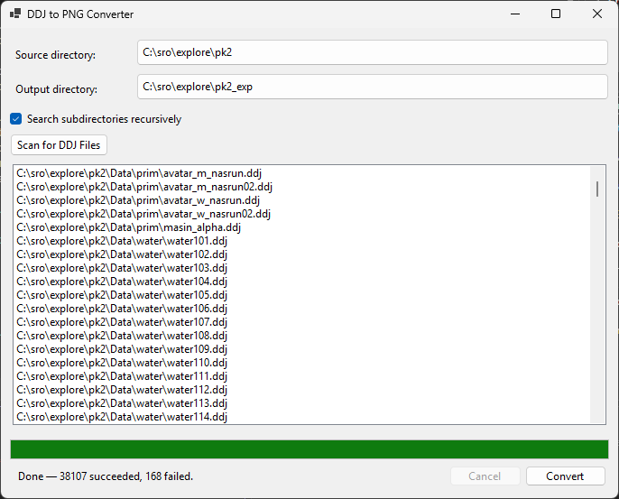

# ddj2png 🚀

> Batch-convert **DDJ** image files from Silkroad Online into standard **PNG** files — fast, parallel, and folder-structure-aware.

<p align="center">
  
  <br>
  <em>ddj2png — main window</em>
</p>

---

## What is it? ❓

Silkroad Online stores its UI and skill textures as `.ddj` files — a proprietary container that wraps a standard DDS (DirectDraw Surface) image with a 20-byte custom header prepended. **ddj2png** strips that header, decodes the DDS payload, and saves each file as a regular PNG — for an entire folder tree, in one click.

It is designed for bulk work: point it at your unpacked PK2 folder (potentially thousands of files), pick an output folder, and let it run. All files are processed in parallel and the original subfolder structure is preserved under the output root.

---

## About this project 💬

This is a minimalist hobby tool, built to solve a specific personal problem that kept coming up across other personal projects. It does one thing and does it well — no configuration files, no plugin system, no extras. Development choices favor simplicity and directness over extensibility, and the scope is intentionally kept small. If it fits your use case, great. If you need something more general-purpose, there are larger tools out there.

---

## Quick start ⚡

1. Download the latest `ddj2png.exe` from [Releases](../../releases) — single file, no installer, no .NET runtime required.
2. Run it directly.
3. Follow the steps in the next section.

---

## How to use 🛠️

### Step by step

| # | Action | Notes |
|---|--------|-------|
| 1 | Click **Browse…** next to **Source directory** | Select the root folder containing your `.ddj` files (e.g. `C:\sro\pk2\Data`) |
| 2 | Check **Search subdirectories recursively** | Recommended for full PK2 trees |
| 3 | Click **Browse…** next to **Output directory** | Select or create the destination folder (e.g. `C:\sro\pk2_png`) |
| 4 | Click **Scan for DDJ Files** | Lists every `.ddj` found and shows the total count |
| 5 | Click **Convert** | Progress bar and status label update in real time |
| 6 | *(optional)* Click **Cancel** | Stops gracefully — already-saved files are kept |

### Folder structure is preserved

Output files mirror the input tree exactly, so you never lose track of where a texture came from:

```
Input:   C:\sro\pk2\Data\icon\skills\ice.ddj
Output:  C:\sro\pk2_png\Data\icon\skills\ice.png
```

---

## Supported formats 🔄

Every DDS pixel format used by the Silkroad client is supported:

| Format | Description |
|--------|-------------|
| DXT1 | BC1 — opaque or 1-bit alpha |
| DXT2 / DXT3 | BC2 — explicit 4-bit alpha |
| DXT4 / DXT5 | BC3 — interpolated alpha |
| R8G8B8 | 24-bit uncompressed RGB |
| A8R8G8B8 | 32-bit ARGB |
| X8R8G8B8 | 32-bit RGB (alpha ignored) |
| A8B8G8R8 | 32-bit ABGR |
| A1R5G5B5 / X1R5G5B5 | 16-bit, 1-bit alpha |
| A4R4G4B4 / X4R4G4B4 | 16-bit, 4-bit alpha |
| R5G6B5 | 16-bit, no alpha |

---

## How it works ⚙️

```
DDJ file on disk
     │
     ▼
DdjReaderService    ← strips the 20-byte DDJ header
     │
     ▼
DdsDecoderService   ← decodes DDS payload (DXT1/3/5 or RGB variants) → Bitmap
     │
     ▼
PngExportService    ← saves Bitmap as PNG, creating subdirectories as needed
     │
     ▼
PNG file on disk
```

`ConversionService` orchestrates the pipeline using `Parallel.ForEachAsync` (default: 4 threads), keeping I/O off the UI thread and capping progress updates at ~200 per run to stay responsive on large batches.

---

## Building from source 🧱

**Requirements:** [.NET 10 SDK](https://dotnet.microsoft.com/en-us/download/dotnet/10.0) · Windows · Visual Studio 2026 *(used during development)*

### Run in development mode

```bash
dotnet run --project src/DdjToPng.App
```

### Build

```bash
# Debug build (fast, for development)
dotnet build src/DdjToPng.App/DdjToPng.App.csproj

# Release build
dotnet build src/DdjToPng.App/DdjToPng.App.csproj --configuration Release
```

### Run tests

```bash
# All tests
dotnet test

# Tests with detailed output
dotnet test --logger "console;verbosity=normal"

# Tests for Core only
dotnet test tests/DdjToPng.Core.Tests/DdjToPng.Core.Tests.csproj
```

### Publish (self-contained single-file exe)

```bash
dotnet publish src/DdjToPng.App/DdjToPng.App.csproj \
  -c Release -r win-x64 --self-contained true \
  -p:PublishSingleFile=true -o publish/
# → publish/ddj2png.exe
```

---

## Architecture 🏗️

Clean separation between business logic and the UI layer:

```
/src
  /DdjToPng.Core           ← pure business logic, no WinForms dependency
    /Interfaces            ← service contracts
    /Models                ← immutable records (ConversionResult, ConversionOptions)
    /Services              ← pipeline implementations
    /ViewModels            ← presentation logic (INotifyPropertyChanged, no MVVM framework)
  /DdjToPng.App            ← WinForms shell, manual DI wiring in Program.cs
    /Views                 ← MainForm
/tests
  /DdjToPng.Core.Tests
    /Decoders              ← DDS decoder tests (in-memory fake buffers, no disk I/O)
    /Services              ← service unit tests
    /ViewModels            ← ViewModel tests
```

Every service and ViewModel was built test-first (red → green → refactor). All 43 tests run without touching the filesystem, except for `PngExportService` integration tests.

---

## AI disclosure 🤖

This project was developed with the assistance of [Claude Code](https://claude.ai/code) (Anthropic). AI was used throughout — architecture decisions, implementation, tests, CI/CD setup, and documentation.

---

## License ⚖️

[MIT](MIT-LICENSE)

